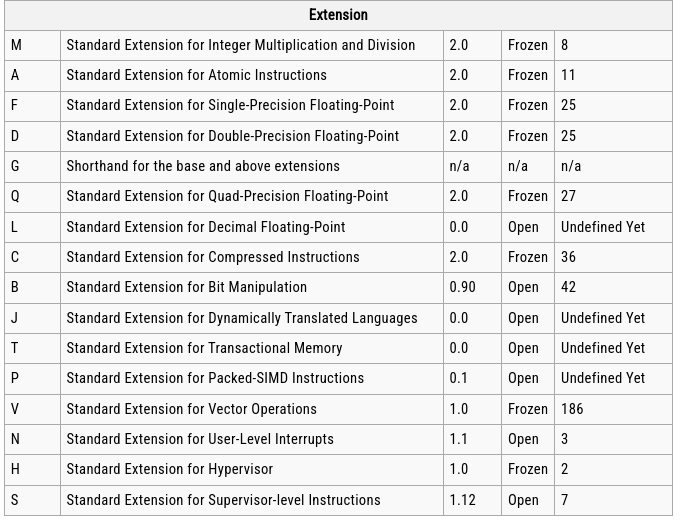

# TODO

- Example file with simple RISC-V source code
- adjust example.py (instance of example, class of example)
- try with --dry-run option, add microarchitecture at the end of name
- Add template file for C908
- common RISC-V naming

- start with implementation of RISC-V architecture
- copy whole file, adjust stack specifications etc., look for architecture-specific things
- implement first instructions at the end of file

# RISC-V 

## Base Integer ISA
- Base Integer ISA, characterized by their width (XLEN) of integer registers (two's complement) and corresponding size 
of the address space:
  - RV32I (32 bit Integer base ISA)
    - RV32E (reduced version for microcontroller, only 16 integer registers)
  - RV64I (64 bit Integer base ISA)
    - RV64E (reduced version for microcontroller, only 16 integer registers)
  - (RV128I, future variant supporting 128 bit integers)
- Base RISC-V ISa has fixed-length 32-bit instructions that must be naturally aligned on 32-bit boundaries
- There is no dedicated stack pointer or subroutine return address link register in the Base
Integer ISA; the instruction encoding allows any x register to be used for these purposes.
However, the standard software calling convention uses register x1 to hold the return address
for a call, with register x5 available as an alternate link register. The standard calling
convention uses register x2 as the stack pointer

### Base Integer Instructions

#### Integer Register-Immediate Instructions

I-Type:
- ADDI #
- SLTI #
- ANDI #
- ORI #
- XORI # 
Special I-Type:
- SLLI #
- SRLI #
- SRAI #
U-Type:
- LUI
- AUIPC

#### Integer Register-Register Operations

R-Type:
- ADD
- SLT
- SLTU
- AND
- OR
- XOR
- SLL
- SRL
- SUB
- SRA

### NOP Instruction
- NOP = ADDI x0, x0, 0

### Control Transfer Instructions
  #### Unconditional Jumps
  #### Conditional Branches

### Load and Store Instructions
### Memory Ordering Instructions
### Environment Call and Breakpoints
### HINT Instructions

## ISA Extensions

## Memory

- A RISC-V hart has a single byte-addressable address space of 2^XLEN
bytes for all memory accesses. A word of
memory is defined as 32 bits (4 bytes). Correspondingly, a halfword is 16 bits (2 bytes), a doubleword is
64 bits (8 bytes), and a quadword is 128 bits (16 bytes).
- A component is termed a core if it contains an independent instruction fetch unit. A RISC-V-compatible
core might support multiple RISC-V-compatible hardware threads, or harts, through multithreading.

# C908 Overview

- Supports RISC-V 64GCB[V] ISA 

# Questions

- Where do data types (abbrev_unfold) come from
- make vs build vs parse